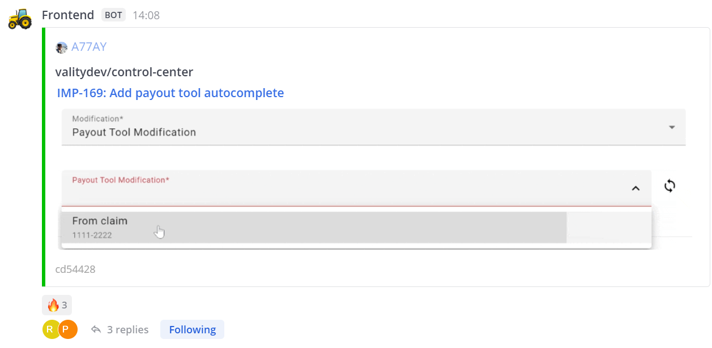
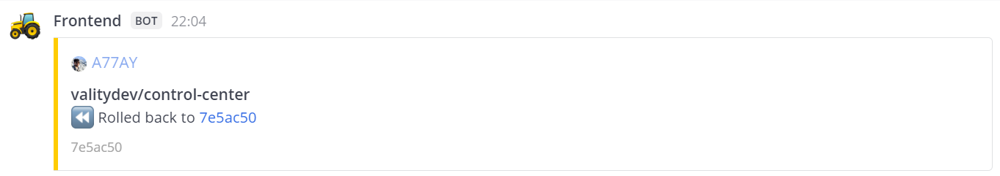

# Mattermost Deployment Notification Action

Notification of **Mattermost** (or **Slack**):

- After PR's merge into main branch and [successful deployment](#only-successful-rollouts)
- After PR's rollback (when you call the deployment action again not on the last PR)




The message contains:

- Author
- Repository
- PR title
- PR comment
- Commit ID

### Only successful rollouts

> [!NOTE]  
> Action idea in notifications about successfully deployments when you want to know what rolled out and rolled back on your main channel (therefore it does not support spam notifications about crashes)
>
> _If you need to notify everything, then you can use [rtCamp/action-slack-notify](https://github.com/rtCamp/action-slack-notify), on which this project is based_

## Usage

```yaml
# .github/workflows/main.yaml

name: Main
on:
  push:
    branches: ["master", "main"]
jobs:
  deploy:
    name: Deploy
    runs-on: ubuntu-latest
    steps:
      - uses: actions/checkout@v4
      - run: npm ci
      - run: npm run build
      - name: Deploy
        run: echo deploy
  notify:
    name: Notify
    runs-on: ubuntu-latest
    needs: [deploy] # We are waiting for a successful rollout
    steps:
      - uses: actions/checkout@v4
      - uses: valitydev/action-mattermost-notify@v0.1.4
        with:
          webhook: ${{ secrets.MATTERMOST_WEBHOOK_URL }}
          channel: "dashboard-deployments" # link path param
          username: "Frontend"
```

## Configuration

https://github.com/valitydev/action-mattermost-notify/blob/master/action.yml#L3-L17

https://github.com/valitydev/action-mattermost-notify/blob/master/action.yml
